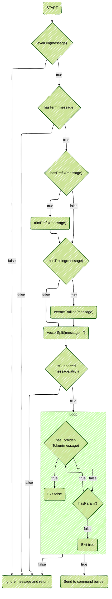

# Structural message parsing

## Goal

The aim of this document is to create the logic for the first step of the parsing, which is to validate the integrity of a message.

## Rules

### Validating messages

- Messages **SHOULD NOT** be longer than 512 characters.
  - If they are, return 417 - ERR_INPUTTOOLONG
- The server **SHOULD** ignore empty messages
- The server **SHOULD** be able to handle single `\n` and `\r` at the end of a message, treating them as if it were a `\r\n` pair.

#### Validating prefixes / sources

- **MUST** start with a `':'`
- **MUST** end with a `' '`
- in the case that it's a user prefix:
  - MAY have a `!`
  - MAY have a `@`

#### Validating commands

- **MUST** be a command that we handle.

#### Validating parameters

Middle parameters:

- **MUST NOT** exceed 15
  - if there are more than 15 parameters, only 15 will be processed.
- **MUST NOT** contains `' '`, `\r`, `\n` or NULL.

Trailing parameters:

- **MUST** start with `:`
- **MUST NOT** contain NULL, `\r`, `\n`
- **MAY** be empty
- **MAY** contain zero or more space(s).

### Message separator

Messages MUST be separated by `\r\n` or `0x0D0x0A`.

---

## Algorithmic flowchart

### Prototype

```cpp
bool hasPrefix(const std::string &message);
bool hasTermination(const std::string &message);
bool hasTrailing(const std::string &message);
int lenIsValid(const std::string &message);
std::string extractTrailing(const std::message &message);
std::string trimPrefix(const std::string &message);
stringVec vectorSplit(std::string &s, const std::string &del);
std::vector<string> messageStructureIsValid(const std::string &message);
```


